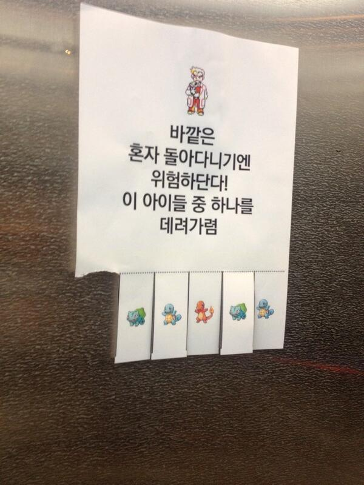

# 더 나은 웹

> 축하해주세요, 캘리포니아주에서 [소비자프라이버시법(CCPA)](https://fortune.com/2019/09/13/what-is-ccpa-compliance-california-data-privacy-law/)이 통과되었습니다!

## 웹은 혼자 돌아다니기엔 위험합니다.

웹은 야생 그 자체입니다.

웹은 당신의 동의 없이 당신의 개인 정보를 수집하고 활동을 감시합니다.

때로는 수집한 개인 정보들이 유출되기도 합니다. 인터넷에서 개인 정보를 스스로 지키세요. 이 문서는 상시 업데이트 됩니다.

*우리의 문서를 읽고 사생활 보호에 친화적인 서비스로 바꾸세요*

## 나는 인터넷에서 숨길 것이 없는데요?

우리가 살고 있는 집을 예로 들어 봅시다.

우리가 우리의 집의 창문에 커튼을 달고, 현관문을 잠그는 이유는 다른 사람들이 우리의 삶 안으로 들어오지 못하게 함일 것입니다.

가족과 함께 저녁을 먹거나, 아이들과 TV를 보거나 혹은 연인과의 스킨십을 하든 우리는 우리의 삶을 남이 볼 수 없게 창문에 커튼을 치고 있을 것입니다.

이중 아무것도 법에 접촉이 되거나 비 윤리적인 부분은 없습니다. 하지만 우리는 이렇게 우리의 삶에 사적인 부분과 공적인 부분을 나누고 있습니다. - [The Crypto Paper](https://github.com/cryptoseb/CryptoPaper)

더 많은 예시를 보고 싶다면 [reddit 의 How do you counter the “I have nothing to hide?” argument?](https://www.reddit.com/r/privacy/comments/3hynvp/how_do_you_counter_the_i_have_nothing_to_hide/) 를 확인해보세요, 혹은 아래링크의 TED 강연을 감상해보세요.

[Glenn Greenwald: Why privacy matters](https://www.ted.com/talks/glenn_greenwald_why_privacy_matters?utm_campaign=tedspread&utm_medium=referral&utm_source=tedcomshare)

## 떳떳하다면 숨길 필요가 없다고 말하는 사람들은 실제로 그렇게 행동하지 않습니다.

에릭 슈미트는 [2009년의 한 인터뷰](https://www.eff.org/deeplinks/2009/12/google-ceo-eric-schmidt-dismisses-privacy)에서 구글의 사생활 침해 논란과 관련해서 "누구도 당신이 한 어떤 일을 알기를 원치 않는다면, 우선 그 일을 하지 말아야 할것이다." 라고 말했습니다.

하지만 2005년, 에릭 슈미트는 CNET의 기자가 자신의 사생활을 기사화했다는 이유로 구글 직원들에게 CNET 기자들과 [대화하지 말라고 지시](https://news.hitb.org/content/google-blacklists-cnet-reporters-publishing-eric-schmidts-personal-info)했습니다. (웃긴 점은 CNET의 기자는 구글에 에릭 슈미트를 검색하여 기사를 작성했습니다)

또 다른 예로 "프라이버시는 더 이상 사회적 규범이 아니다", "프라이버시의 시대는 끝났다(The Age of Privacy is Over)"라고 [공언](http://www.hani.co.kr/arti/science/future/885587.html)한바 있는 페이스북의 마크 주커버그는 결혼 후 자신의 사생활을 지키기 위해 팔로알토에 있는 [자신의 집 주변의 주택 4채를 사들였습니다](https://abcnews.go.com/Business/mark-zuckerberg-buys-homes-surrounding-palo-alto-calif/story?id=20542803).

## 무서운 사실은, 감시당하고 있다는 사실을 망각하고 있다는 것 입니다.

(준비중)

당신이 휴대폰을 사용해 전화를 걸면, 당신의 위치정보도 통신 기록으로 기록됩니다.

독일 녹생당 정치인 말테 스피츠는 2009년 독일 통신사를 고소하였습니다. 그 후 6개월 분량의 자신의 통신 기록을 통신사를 통해 전달 받아 언론에 공개하였습니다.

*통신 기록을 시각화한 자료 (zeit online)*

## 정부와 일반적인 기업들은 당신의 사생활을 보호해주지 않습니다.

보안과 암호화에 중점을 둔 서비스를 사용하세요. 아래의 사건들을 확인해보세요.

- [대한민국의 정보 보안 사고 목록](https://ko.wikipedia.org/wiki/%EB%8C%80%ED%95%9C%EB%AF%BC%EA%B5%AD%EC%9D%98_%EC%A0%95%EB%B3%B4_%EB%B3%B4%EC%95%88_%EC%82%AC%EA%B3%A0_%EB%AA%A9%EB%A1%9D)
    - [한국의 개인정보 유출사태 (나무위키)](https://namu.wiki/w/%EA%B0%9C%EC%9D%B8%EC%A0%95%EB%B3%B4%20%EC%9C%A0%EC%B6%9C%EC%82%AC%ED%83%9C)
- [아이클라우드 누드 사진 유출 사건](https://namu.wiki/w/%ED%8C%A8%ED%94%84%EB%8B%9D?from=%EC%95%84%EC%9D%B4%ED%81%B4%EB%9D%BC%EC%9A%B0%EB%93%9C%20%EB%88%84%EB%93%9C%20%EC%82%AC%EC%A7%84%20%EC%9C%A0%EC%B6%9C%20%EC%82%AC%EA%B1%B4)
- [프리즘 폭로 사건](https://namu.wiki/w/NSA%20%EA%B8%B0%EB%B0%80%EC%9E%90%EB%A3%8C%20%ED%8F%AD%EB%A1%9C%EC%82%AC%EA%B1%B4?from=%ED%94%84%EB%A6%AC%EC%A6%98%20%ED%8F%AD%EB%A1%9C%20%EC%82%AC%EA%B1%B4)

    

- [소니 픽처스 해킹 사건](https://namu.wiki/w/%EC%86%8C%EB%8B%88%20%ED%94%BD%EC%B2%98%EC%8A%A4#s-5.2)

---

## 어떻게 웹에서 나의 사생활을 "최대한" 지킬수 있을까요?

### 정부와 기업 혹은 개인 에게서 개인 정보 보호하기

- 소셜 미디어를 되도록이면 자제하세요 (사용을 안하는게 제일 좋습니다)
  - 꼭 사용해야 한다면 항상 누군가가 보고있음을 명심하세요
    - 다른 사용자에게서 나의 정보를 지키세요 (단, 여전히 기업들은 당신의 정보를 보고있습니다)
      - 페이스북 설정으로 개인 정보를 보호하기 (업데이트 예정)
      - 인스타그램 설정으로 개인 정보를 보호하기 (업데이트 예정)
      - 트위터 설정으로 개인 정보를 보호하기 (업데이트 예정)
  - 꼭 필요한 개인 정보만을 입력하세요
    - 이름외에 더 적어야 하나요? 안써도 그만인 것들은 적지 마세요.
  - 페이스북이 판매하는 상품은 우리 입니다.
    - 페이스북이 스마트폰의 마이크를 통해 사용자의 대화를 엿듣고 있습니다.
      - [Facebook Paid Contractors to Transcribe Users’ Audio Chats](https://www.bloomberg.com/news/articles/2019-08-13/facebook-paid-hundreds-of-contractors-to-transcribe-users-audio)
      - [Facebook Just Gave 1.3 Billion Messenger Users A Reason To Delete Their Accounts](https://www.forbes.com/sites/kateoflahertyuk/2019/08/14/did-facebook-just-give-13-billion-users-a-reason-to-delete-their-account)
      - [Yes, You Should Delete Facebook](https://medium.com/s/story/yes-you-should-delete-facebook-heres-why-bc623a3b4625)
    - 페이스북이 Messenger, whatsapp, Instagram, Oculus 를 소유중인 사실을 알고 있나요?
- [링크드인에서 나의 개인 정보를 보호하세요(영문)](https://betterweb.qwant.com/how-to-protect-your-privacy-on-linkedin/)
- [Window PC, MAC OS, Android, iOS 의 설정을 통해 사생활을 보호하세요(영문)](https://spreadprivacy.com/device-privacy-protection/)

### 향상된 방법

- Window를 사용하지 마세요! Mac OS를 사용하세요, 제일 좋은 방법은 Linux 를 사용하는 것입니다.
  - Ubuntu 는 가장 유명한 Linux 배포판중 하나입니다.
  - [Qubes OS](https://www.qubes-os.org/)는 프리즘 폭로 사건의 폭로자 에드워드 스노든이 사용하고 있는걸로 알려진 Linux의 배포판입니다.
  - [elementary OS](https://elementary.io/)는 Ubuntu 기반으로 만들어진 Linux 배포판의 한 종류로, Window와 Mac의 대안 OS로 각광받고 있습니다.
- 비밀번호를 사이트마다 다르게 설정하세요. 아무리 당신이 개인 정보를 철저하게 관리해도, 개인 정보를 가지고 있는 기업(서비스, 앱)에서 개인 정보가 유출된다면 아무런 소용이 없습니다.
  - 쉬운 관리를 위해 패스워드 관리 툴을 사용하세요
    - LastPass
    - 1Password
    - Dashlane
    - Bitwarden
    - Keeper
- 사생활 보호 친화적인 브라우저를 사용하세요 (IE, Chrome 을 사용하지 마세요)
  - Desktop
    - [Firefox](https://firefox.com/) (recommend)
      - Tor Browser가 이 브라우저를 기반으로 만들어집니다.
      - Firefox의 [about:config에서 개인 정보와 관련된 설정을 변경](https://www.privacytools.io/browsers/#about_config)하세요
        - 소개된 설정중 일부는 고민해 봐야됩니다.
          - network.http.referer.XOriginPolicy
            - [@0vv](https://github.com/0vv)는 이 설정을 1로 사용하고있습니다.
          - network.http.referer.XOriginTrimmingPolicy
            - [@0vv](https://github.com/0vv)는 이 설정을 0으로 사용하고있습니다.
          - browser.sessionstore.max_tabs_undo
            - [@0vv](https://github.com/0vv)는 이 설정을 10으로 사용하고있습니다.
        - browser.search.region 을 US 로 변경하세요
    - [Brave](https://brave.com/) (recommend)
      - Tor network 사용모드가 내장되어 있습니다.
    - [Tor Browser](https://www.torproject.org/) (Tor network 사용)
  - Mobile
    - [Duckduckgo](https://duckduckgo.com/app) (recommend)
    - Brave (recommend)
    - Firefox (recommend)
      - Firefox focus (recommend)
    - Bromite (Android)
    - snowhaze (iOS)
    - [Tor Browser](https://guardianproject.info/fdroid/) (Android) (Tor network 사용)
    - [Onion Browser](https://onionbrowser.com/) (iOS) (Tor network 사용)
  - 브라우저 애드온
    - uBlock Origin (recommend)
      - uBlock Origin (광고차단, 추적기 차단) + Privacy Badger (쿠키 차단 및 관리) + HTTPS Everywhere (HTTP요청을 HTTPS로 변경) 조합은 훌륭합니다.
    - HTTPS Everywhere (recommend)
    - Privacy Badger (recommend)
    - Decentraleyes (recommend)
    - Cookie AutoDelete
    - Snowflake
      - 검열되는 국가들의 인터넷 사용자를 위해 당신이 브라우저로 Snowflake Proxy가 되어주세요
  - 자세히 알아 보고 싶다면 [사생활 보호에 친화적인 브라우저는 무엇이 있을까요? (준비중)](./articles/test.md) 를 확인해보세요
- 사생활 보호 친화적인 검색엔진을 사용하세요
  - [Duckduckgo](https://duckduckgo.com/) (제일 한글검색 잘됨)
  - [Qwant](https://www.qwant.com/)
  - [Startpage](https://www.startpage.com/)
  - [searx](https://searx.me/)
- [구글에서 벗어나세요](https://spreadprivacy.com/how-to-remove-google/)
  - 당신의 메일을 구글이 읽고 있습니다.
  - 당신의 사진을 구글이 보고 있습니다.
    - 당신의 사진에 있는 사람들을 구글은 알고 있습니다.
  - 당신의 연락처를 구글이 알고 있습니다.
  - 당신의 위치를 구글이 알고 있습니다.
  - [필터버블을 경계](https://spreadprivacy.com/google-filter-bubble-study/)하세요.
  - 크롬의 시크릿탭은 사용자를 온전히 [지켜주지 않습니다](https://spreadprivacy.com/is-private-browsing-really-private/).
- 불가능에 가깝겠지만, 카카오톡을 사용하지 마세요, 사용하더라도 비밀 채팅을 이용하세요
  - 대안으로 사용할 수 있는 메신저는 다음과 같습니다.
    - Signal
    - Telegram

### 기술을 이용해서 개인 정보 보호하기

- VPN을 사용하고, 더 나아가 Tor 를 사용하세요
- DNS를 [1.1.1.1](https://1.1.1.1/)로 바꾸세요. 혹은 유료 DNS를 사용하세요 (8.8.8.8을 사용하지 마세요)

## 더 알아보기

- [사생활 보호에 친화적인 브라우저는 무엇이 있을까요? (준비중)](./articles/test.md)
