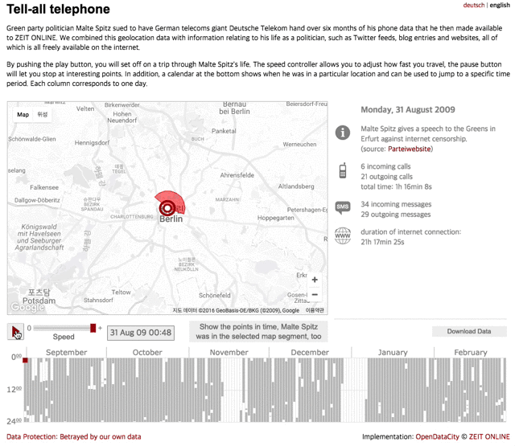
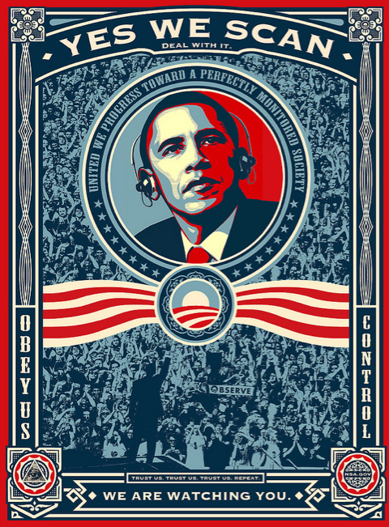

# 우리는 감시 당하고 있습니다

인터넷에서 개인 정보를 스스로 지키세요. 이 문서는 상시 업데이트 됩니다.

_우리의 문서를 읽고 사생활 보호에 친화적인 서비스로 바꾸세요_

## 나는 인터넷에서 숨길 것이 없는데요?

우리가 살고 있는 집을 예로 들어 봅시다.

우리가 우리의 집의 창문에 커튼을 달고, 현관문을 잠그는 이유는 다른 사람들이 우리의 삶 안으로 들어오지 못하게 함일 것입니다.

가족과 함께 저녁을 먹거나, 아이들과 TV를 보거나 혹은 연인과의 스킨십을 하든 우리는 우리의 삶을 남이 볼 수 없게 창문에 커튼을 치고 있을 것입니다.

이중 아무것도 법에 접촉이 되거나 비 윤리적인 부분은 없습니다. 하지만 우리는 이렇게 우리의 삶에 사적인 부분과 공적인 부분을 나누고 있습니다. - [The Crypto Paper](https://github.com/cryptoseb/CryptoPaper)

더 많은 예시를 보고 싶다면 [reddit 의 How do you counter the "I have nothing to hide?" argument?](https://www.reddit.com/r/privacy/comments/3hynvp/how_do_you_counter_the_i_have_nothing_to_hide/) 를 확인해보세요, 혹은 아래링크의 TED 강연을 감상해보세요.

[Glenn Greenwald: Why privacy matters](https://www.ted.com/talks/glenn_greenwald_why_privacy_matters?utm_campaign=tedspread&utm_medium=referral&utm_source=tedcomshare)

## 떳떳하다면 숨길 필요가 없다고 말하는 사람들은 실제로 그렇게 행동하지 않습니다.

에릭 슈미트는 [2009년의 한 인터뷰](https://www.eff.org/deeplinks/2009/12/google-ceo-eric-schmidt-dismisses-privacy)에서 구글의 사생활 침해 논란과 관련해서 "누구도 당신이 한 어떤 일을 알기를 원치 않는다면, 우선 그 일을 하지 말아야 할것이다." 라고 말했습니다.

하지만 2005년, 에릭 슈미트는 CNET의 기자가 자신의 사생활을 기사화했다는 이유로 구글 직원들에게 CNET 기자들과 [대화하지 말라고 지시](https://news.hitb.org/content/google-blacklists-cnet-reporters-publishing-eric-schmidts-personal-info)했습니다. (웃긴 점은 CNET의 기자는 구글에 에릭 슈미트를 검색하여 기사를 작성했습니다)

또 다른 예로 "프라이버시는 더 이상 사회적 규범이 아니다", "프라이버시의 시대는 끝났다(The Age of Privacy is Over)"라고 [공언](http://www.hani.co.kr/arti/science/future/885587.html)한바 있는 페이스북의 마크 주커버그는 결혼 후 자신의 사생활을 지키기 위해 팔로알토에 있는 [자신의 집 주변의 주택 4채를 사들였습니다](https://abcnews.go.com/Business/mark-zuckerberg-buys-homes-surrounding-palo-alto-calif/story?id=20542803).

## 무서운 사실은, 감시당하고 있다는 사실을 망각하고 있다는 것 입니다.

(준비중)

당신이 휴대폰을 사용해 전화를 걸면, 당신의 위치정보도 통신 기록으로 기록됩니다.

독일 녹생당 정치인 말테 스피츠는 2009년 독일 통신사를 고소하였습니다. 그 후 6개월 분량의 자신의 통신 기록을 통신사를 통해 전달 받아 언론에 공개하였습니다.

_통신 기록을 시각화한 자료 (zeit online)_

## 정부와 일반적인 기업들은 당신의 사생활을 보호해주지 않습니다.

보안과 암호화에 중점을 둔 서비스를 사용하세요. 아래의 사건들을 확인해보세요.

-   [대한민국의 정보 보안 사고 목록](https://ko.wikipedia.org/wiki/%EB%8C%80%ED%95%9C%EB%AF%BC%EA%B5%AD%EC%9D%98_%EC%A0%95%EB%B3%B4_%EB%B3%B4%EC%95%88_%EC%82%AC%EA%B3%A0_%EB%AA%A9%EB%A1%9D)
    -   [한국의 개인정보 유출사태 (나무위키)](https://namu.wiki/w/%EA%B0%9C%EC%9D%B8%EC%A0%95%EB%B3%B4%20%EC%9C%A0%EC%B6%9C%EC%82%AC%ED%83%9C)
-   [아이클라우드 누드 사진 유출 사건](https://namu.wiki/w/%ED%8C%A8%ED%94%84%EB%8B%9D?from=%EC%95%84%EC%9D%B4%ED%81%B4%EB%9D%BC%EC%9A%B0%EB%93%9C%20%EB%88%84%EB%93%9C%20%EC%82%AC%EC%A7%84%20%EC%9C%A0%EC%B6%9C%20%EC%82%AC%EA%B1%B4)
-   [프리즘 폭로 사건](https://namu.wiki/w/NSA%20%EA%B8%B0%EB%B0%80%EC%9E%90%EB%A3%8C%20%ED%8F%AD%EB%A1%9C%EC%82%AC%EA%B1%B4?from=%ED%94%84%EB%A6%AC%EC%A6%98%20%ED%8F%AD%EB%A1%9C%20%EC%82%AC%EA%B1%B4)

    

-   [소니 픽처스 해킹 사건](https://namu.wiki/w/%EC%86%8C%EB%8B%88%20%ED%94%BD%EC%B2%98%EC%8A%A4#s-5.2)
